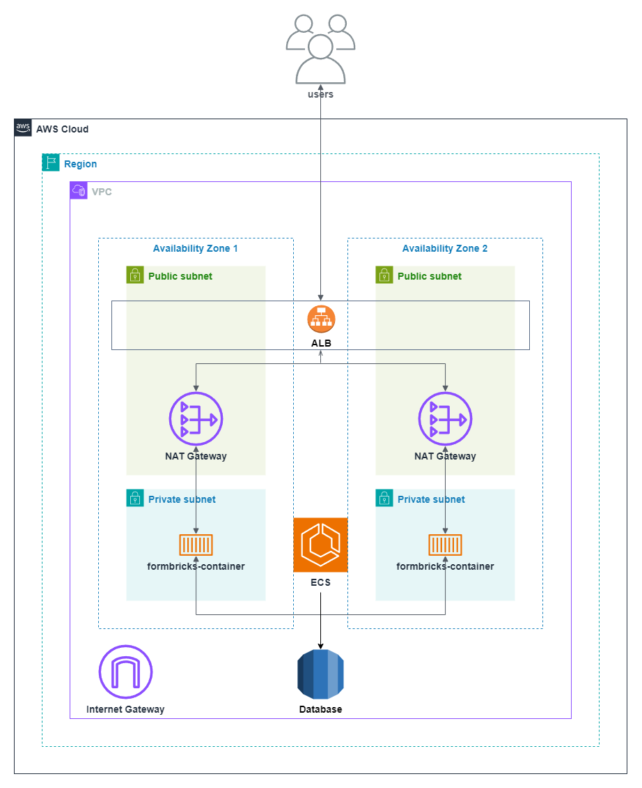

# Formbricks 🤝 AWS
This repository provides the Terraform configuration to deploy and manage the Formbricks application on AWS. This project builds on top of the excellent [Amazon ECS Blueprints](https://github.com/aws-ia/ecs-blueprints) developed by the AWS team. It leverages the following AWS services to deliver a scalable and reliable environment for the Formbricks application:
- ECS on Fargate
- Application Load Balancer
- VPC
- Cloud Map

## AWS Architecture Diagram


## Key Features
* **Fargate Workload:** ECS Fargate simplifies container deployment by removing the need to manage EC2 instances.
* **Mixed Fargate Compute (Dedicated and Spot):** Cost-effectiveness with availability guarantees.
* **Application Load Balancing:** Distributes incoming traffic for high availability.
* **Networking:** Secure and segmented public and private subnets across availability zones.
* **Service Discovery:** Streamlined communication between services via private DNS.
* **Secrets Management(Optional):** Integration with AWS Secrets Manager for secure storage and retrieval of sensitive data.

# Quickstart
1. **Prerequisites**
   * Terraform CLI: Ensure Terraform CLI is installed on your machine. For detailed instructions on installation, visit the [Terraform Installation Guide](https://developer.hashicorp.com/terraform/tutorials/aws-get-started/install-cli).
   * AWS credentials (configured via environment variables or a profile) with administrator role access.
   * Clone the GitHub Repository.
2. **Deployment**
   * Set AWS credentials:
       ```bash
       export AWS_ACCESS_KEY_ID=your_access_key
       export AWS_SECRET_ACCESS_KEY=your_secret_key
       ```
   * Deploy core infrastructure:
      * Change directory to `terraform/core-infra`
      * Initialize Terraform: `terraform init`
      * Apply changes:  `terraform apply`
      * More detailed instructions can be found [here](./terraform/core-infra/README.md).
   * Deploy webapp infrastructure:
      * Change directory to `terraform/webapp-service`
      * Initialize Terraform: `terraform init`
      * Generate values for `NEXTAUTH_SECRET` and `ENCRYPTION_KEY`: `openssl rand -hex 32`
      * Apply changes, providing configuration values:
           ```bash
           terraform apply -var "DATABASE_URL=your_db_connection_string" \
                           -var "NEXTAUTH_SECRET=your_nextauth_secret" \
                           -var "ENCRYPTION_KEY=your_encryption_key"
           ```
      * More detailed instructions can be found [here](./terraform/webapp-service/README.md).       
3. **Access your application**  
Locate the public DNS name or IP address of the Application Load Balancer in the AWS console or Terraform output.

  :warning: **Important Notes** :warning:
  * **Security:** Use AWS Secrets Manager for storing and sharing sensitive information in production environments.
  * **Destroy order:** Destroy webapp service infrastructure before destroying core infrastructure. 
  * **Data persistence:** Ensure adequate database provisions for production workloads.

## Additional Information

* Formbricks Documentation: https://formbricks.com/docs
* Terraform AWS ECS Modules: https://registry.terraform.io/modules/terraform-aws-modules/ecs/aws/latest
* AWS ECS Blueprints: https://github.com/aws-ia/ecs-blueprints
